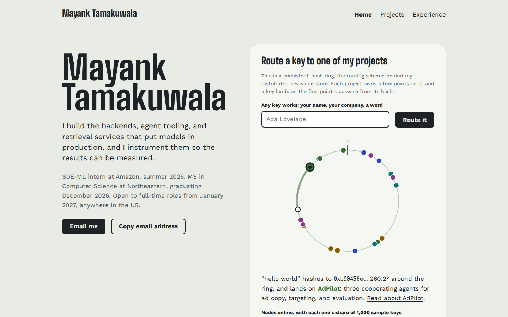

# Mayank Tamakuwala: homepage

A static personal homepage built with vanilla HTML5, CSS3, and ES6 modules. Its centerpiece is a live consistent-hash ring: type any key and watch it route to one of my projects.

- **Author:** Mayank Tamakuwala ([GitHub](https://github.com/MayankTamakuwala), [LinkedIn](https://linkedin.com/in/mayanktamakuwala))
- **Class:** TODO: course name and link to the class page
- **Live site:** TODO: deployed URL
- **Demo video:** TODO: public link to the narrated video
- **Design document:** [docs/DESIGN.md](docs/DESIGN.md)



## Project objective

Build a homepage that lets a recruiter or engineer who has never met me decide within a minute whether I am worth a conversation, then contact me in one click. The first screen states what I build, where I have done it, and when I am available. The creative component demonstrates the kind of engineering I do instead of describing it.

The assignment constraints: front-end only, no backend, no component libraries, no jQuery, and all JavaScript in ES6 modules.

## Features

- **Consistent-hash ring (creative component).** Each of five projects owns several virtual nodes on a 32-bit ring. A key is hashed with FNV-1a plus a MurmurHash3 finalizer and routed to the first online point clockwise, with an animated arc showing the walk. Unchecking a node takes it offline, and a live count compares how many of 1,000 sample keys moved against naive `hash mod N` placement. A slider sets points per node from 1 to 16, so visitors can watch the load even out.
- **Project filter.** Toggle buttons filter the projects by area, announce the result in a live region, and keep the filter in the URL (`projects.html?area=frontend`) so a filtered view can be shared.
- **Copy email address.** Copies my address with the Clipboard API, and shows the address if the browser blocks it.
- **Three pages:** Home, Projects, and Experience. Home (`index.html`) is the only AI-generated page; Projects and Experience were manually written by Mayank Tamakuwala (see [Use of generative AI](#use-of-generative-ai)).
- **Accessibility:** native controls only, a skip link, visible focus, labeled inputs, live regions for dynamic text, alt text on every image, and the route animation turned off under `prefers-reduced-motion`.

## Project structure

```
.
├── index.html            AI-generated home page with the hash ring
├── projects.html         Manually written filterable project grid
├── experience.html       Manually written experience timeline
├── css/
│   └── style.css         All styles, organized by numbered section
├── js/
│   ├── main.js           Entry module, initializes each page's features
│   ├── hashRing.js       Ring logic (pure, no DOM, unit tested)
│   ├── ringView.js       SVG drawing and route animation
│   ├── ringWidget.js     Form, node toggles, slider, live text
│   ├── projects.js       Project data used by the ring
│   ├── projectFilter.js  Projects page filter
│   └── copyEmail.js      Copy email button
├── images/               Favicon, project diagrams, screenshot
├── fonts/                Self-hosted Big Shoulders and Work Sans (SIL OFL)
├── docs/
│   ├── DESIGN.md         Design document
│   └── mockups/          Wireframes
├── tests/
│   └── hashRing.test.js  Unit tests for the ring (node:test)
├── eslint.config.js
├── package.json
└── LICENSE
```

## Instructions to build

Requirements: Node.js 20 or newer.

```bash
git clone https://github.com/MayankTamakuwala/CS5610-Project-1.git
cd CS5610-Project-1
npm install
npm start
```

`npm start` serves the site at http://localhost:3000. A server is required because browsers block ES modules loaded from `file://` URLs. VS Code Live Server works too.

There is no build step. The files in the repository are the site.

### Quality checks

```bash
npm run lint           # ESLint with the class config
npm run format         # Prettier, rewrites files in place
npm run format:check   # Prettier, check only
npm test               # Unit tests for the hash ring
```

HTML validity is checked by uploading each page to https://validator.w3.org/#validate_by_upload.

### Deploying to GitHub Pages

Push to GitHub, then open **Settings > Pages**, choose **Deploy from a branch**, and select `main` with the `/ (root)` folder. The site is published at `https://<username>.github.io/<repository>/`. All paths are relative, so it works from a subfolder.

## How the requirements are met

| Requirement | Where |
| --- | --- |
| ES6 modules | `"type": "module"` in `package.json`, `<script type="module" src="./js/main.js">` on every page |
| Original JS over 5 lines | `js/hashRing.js`, `js/ringView.js`, `js/ringWidget.js`, `js/projectFilter.js` |
| Original component | The hash ring on the home page |
| Organized folders | `css/`, `js/`, `images/`, `fonts/`, `docs/` |
| Meta author, description, icon | `<head>` of every page |
| Flexbox grid | Hero, record list, project grid, nav, footer (`css/style.css`) |
| Classes for identifying elements | Every styled or scripted element has a class, selected by class in CSS and JS |
| Standard tags | Buttons are `<button>`, toggles are checkboxes, links are `<a>` |
| No `!important` | None in `css/style.css` |
| Alt text | Every `` |
| Three pages | `index.html` (AI-generated), `projects.html` and `experience.html` (manually written) |
| MIT license | `LICENSE` |

## Use of generative AI

**Scope.** Only the Home page (`index.html`) was generated by AI. Mayank Tamakuwala manually wrote the Projects (`projects.html`) and Experience (`experience.html`) pages.

**Tool.** TODO: confirm the tool and exact model used to generate `index.html`.

**Original prompt.** TODO: paste the actual prompt used to generate `index.html`.

**What I changed by hand.** TODO: describe any manual changes to the generated Home page.

**What I verified myself.** TODO: record the checks actually performed.

## License

Code is released under the [MIT License](LICENSE). The fonts in `fonts/` are licensed separately under the SIL Open Font License; their license files are in the same folder.
