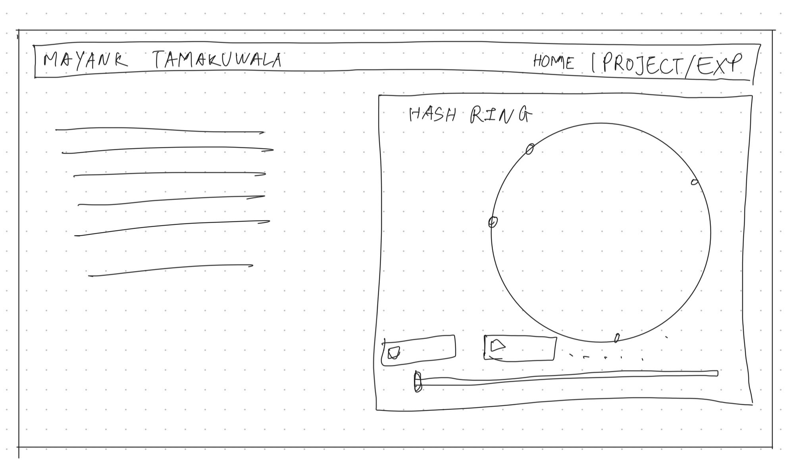
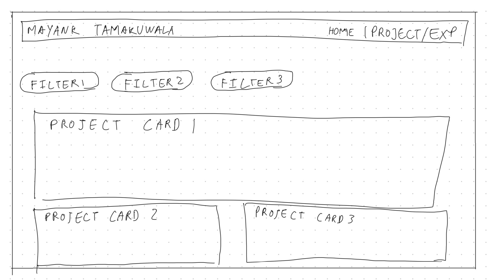
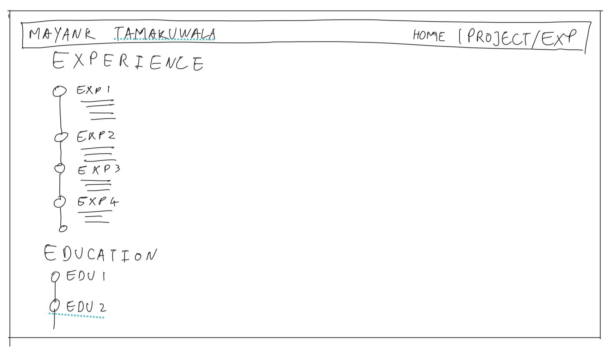
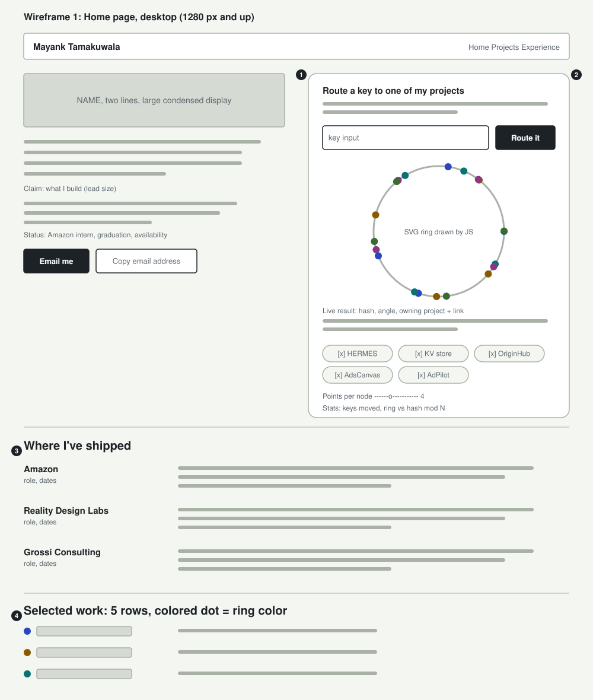
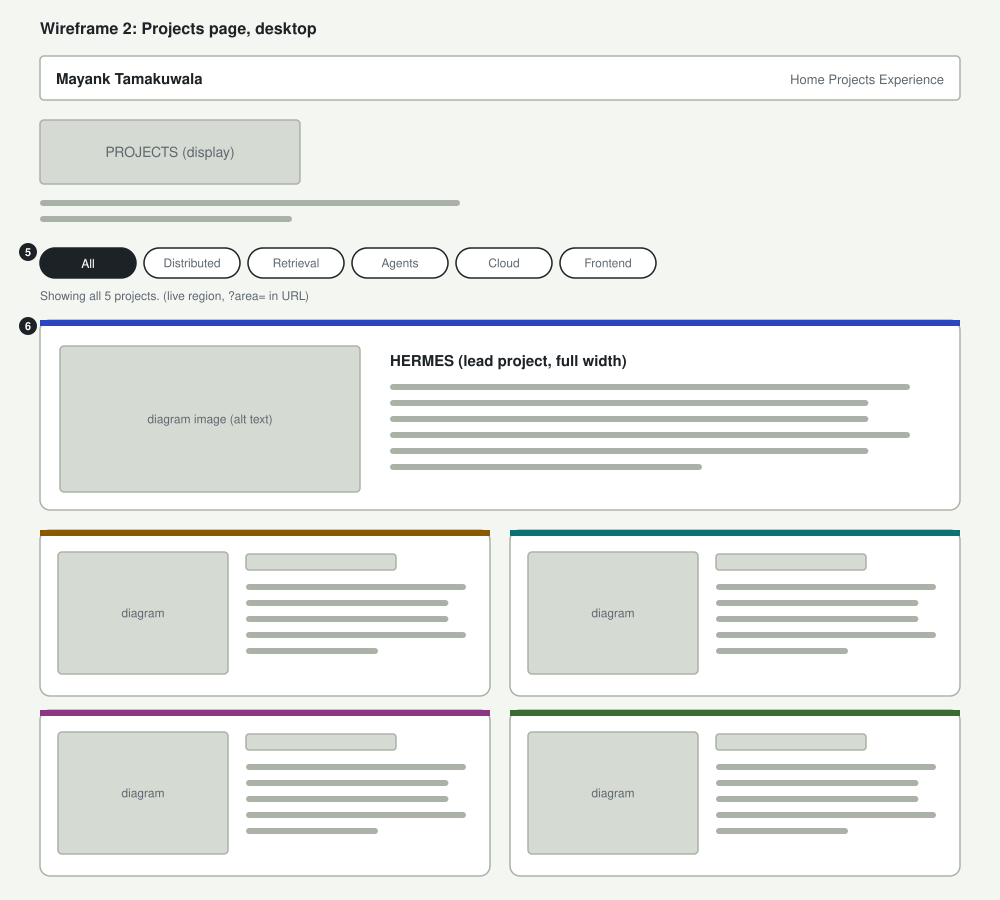
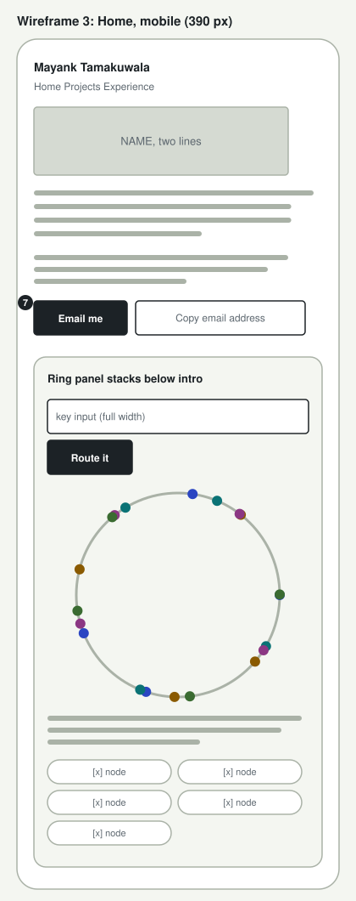

# Design document: Mayank Tamakuwala homepage

## Project description

A static personal homepage for Mayank Tamakuwala, an MS Computer Science student at Northeastern (graduating December 2026) looking for full-time backend, platform, and ML engineering roles from January 2027.

The site has one job: help someone who has never met me decide, quickly, whether I am worth a conversation, and then make contacting me effortless. Most visitors arrive from a LinkedIn profile, a cold email, or a résumé link, so the first screen has to answer three questions without scrolling: what I build, where I have done it, and when I am available.

It is built with vanilla HTML5, CSS3, and ES6 modules. There is no backend, no framework, no component library, and no jQuery.

The site has three pages:

- **Home** (`index.html`, AI-generated): who I am, what I build, and my availability, next to the creative component. Below that, a short record of where I have shipped and five selected projects.
- **Projects** (`projects.html`, manually written by Mayank Tamakuwala): the same five projects in more depth, filterable by area of work.
- **Experience** (`experience.html`, manually written by Mayank Tamakuwala): a timeline of research, work, teaching, and education.

### The creative component: a live consistent-hash ring

The hero holds an interactive consistent-hash ring, the routing scheme from my distributed key-value store. Each of my five projects is a node that owns several points on the ring. A visitor types any key (their name, their company) and watches it hash to a position and travel clockwise to the project that owns it, with a link to read about that project.

Visitors can take nodes offline and see only that node's keys move, with a live count comparing the ring against naive `hash mod N` placement across 1,000 sample keys. A slider changes the number of virtual nodes per project, so they can watch the load even out as points are added.

It differentiates the page because it demonstrates the kind of engineering I want to be hired for instead of describing it. It doubles as navigation, since every result links to a project.

## User personas

### Priya Raman, technical recruiter

Priya sources new-grad backend and ML engineers for a large tech company and reviews about forty profiles an hour on a laptop. She is not an engineer, but she knows which signals her hiring managers ask for.

- **Goals:** confirm role fit, graduation date, availability, and location flexibility in under a minute, then reach out.
- **Frustrations:** portfolios that hide the basics behind animations or clever copy, and sites with no visible email address.

### Daniel Okafor, staff engineer on an ML platform team

Daniel has been asked to review a referral before deciding whether to spend an hour on a phone screen. He reads carefully and distrusts claims he cannot check.

- **Goals:** judge technical depth, see how the candidate reasons about systems, and find source code.
- **Frustrations:** buzzwords with no numbers, and demos that do something flashy without explaining what they show.

### Mei Chen, engineering manager at a startup

Mei received a cold email from me and opens the link on her phone between meetings. She will give the site about two minutes.

- **Goals:** verify that the email's claims hold up, then reply or forward the link to her team.
- **Frustrations:** layouts that only work on desktop, tiny tap targets, and pages that make her pinch and zoom.

### Sam Rivera, university recruiting coordinator

Sam is blind and navigates with a screen reader and keyboard. Sam screens candidates for an early-career program.

- **Goals:** reach the same information as a sighted visitor, in a sensible reading order, and understand what interactive elements do.
- **Frustrations:** unlabeled controls, buttons built from `div`s, and content that changes without being announced.

## User stories

### 1. Priya's one-minute check

Priya clicks my site from a LinkedIn search result. Before scrolling she reads my name, a one-sentence description of what I build, and a status line: Amazon SDE-ML intern, graduating December 2026, open to full-time roles from January 2027 anywhere in the US. That covers her checklist. She clicks **Email me**, her mail client opens with my address filled in, and she sends a message.

- The status line is visible without scrolling at 1280 × 800.
- Email is one click from the first screen and repeated in the footer of every page.

### 2. Daniel tests the claim

Daniel is skeptical of the phrase "distributed systems" on a new-grad résumé. On the home page he types his team's name into the ring and watches it land on AdPilot. He unchecks AdPilot: his key moves to the next node, and the stats line says about a quarter of the sample keys moved, where `hash mod N` would have moved almost 80%. That is the property he would ask about in an interview, demonstrated live. He follows the link to the key-value store project and then to the HERMES source on GitHub.

- The ring explains itself in one short paragraph and names the project it came from.
- Every routing result links to the owning project on the Projects page.
- Taking the last node offline is refused with a message saying why.

### 3. Daniel shares a filtered view

Daniel wants his teammate, who cares about frontend quality, to look too. On the Projects page he clicks **Frontend**. The grid narrows to AdsCanvas and AdPilot, a status line reads "Showing 2 of 5 projects," and the address bar changes to `projects.html?area=frontend`. He pastes that link into Slack, and his teammate lands on the same filtered view.

- The filter is a set of real `<button>` elements with `aria-pressed`.
- The active filter is kept in the URL and restored on load.

### 4. Mei reads on her phone

Mei opens the link on a 390-pixel-wide phone. The layout is one column: name, what I build, status, buttons, then the ring panel. The ring's input, button, and checkboxes are large enough to tap. She uses **Copy email address**, sees the confirmation "Copied maytamaku.saidhwar@gmail.com," and pastes it into her reply.

- Flexbox layouts wrap to one column with no horizontal scrolling at 320 px.
- Buttons, node toggles, and the key input are at least 44 px tall.
- If the browser blocks clipboard access, the status message shows the address instead.

### 5. Sam navigates by keyboard and screen reader

Sam tabs once and reaches a **Skip to content** link. The ring's input has a visible label, the nodes are a labeled group of checkboxes, and every routing result is announced through a polite live region: "'Sam' hashes to 0x…, lands on OriginHub." The project diagrams have alt text describing what they show.

- Every interactive element is a native control: `a`, `button`, `input`.
- Focus is always visible.
- The route animation is skipped for visitors with reduced motion enabled.

### 6. Priya checks the full history

Before a call, Priya wants dates and titles in order. She opens **Experience** and scans a reverse-chronological timeline with each role's organization, title, dates, and location, followed by education and GPA.

## Design mockups

The hand-drawn iPad sketches came first and set the layout of each page. The SVG wireframes refine them, and their numbered markers match the notes below each one.

### Hand-drawn sketches

#### Home

The intro sits on the left and the hash ring panel on the right, with the node checkboxes and the points-per-node slider under the ring.

#### Projects

Filter buttons run across the top. The lead project gets a full-width card, and the rest go in two columns under it.

#### Experience

Roles run down a vertical timeline, newest first, with education below.

### Home, desktop

1. The intro column answers who, what, and when before anything else.
2. The ring panel sits beside the intro, so the creative component is part of the first impression rather than a section at the bottom.
3. "Where I've shipped" pairs a fixed-width label column with prose, so it reads as a record, not as cards.
4. Each selected project carries its ring color as a dot, tying the list back to the ring.

### Projects, desktop

5. Filter buttons sit above the grid, with a live status line under them.
6. HERMES leads at full width. The other four fill a two-column flexbox grid. Each card's top border is its ring color.

### Home, mobile

7. On narrow screens the ring panel stacks below the intro, and the form controls go full width.

## Visual design

**Palette.** A cool, pale sage paper (`#e8ece5`) with a lighter surface (`#f5f7f2`) for panels, near-black ink (`#1c2226`), a muted gray for secondary text (`#505a62`), and a hairline rule (`#b9c2b6`). The only saturated colors on the site are the five project hues: cobalt for HERMES, ochre for the key-value store, teal for OriginHub, plum for AdsCanvas, and moss for AdPilot. Color always means "this project," on the ring, in the lists, and on the cards. Every project hue passes WCAG AA contrast (4.5:1) as text on both backgrounds.

**Type.** Big Shoulders Bold, a condensed display face drawn from industrial signage, for the name and headings. Work Sans for body text. Both are self-hosted under the SIL Open Font License, so the page makes no third-party requests.

**Layout.** Left-aligned throughout, with a 74rem maximum width and body text capped near 62 characters per line. Every multi-column layout is flexbox with `flex-wrap`, so columns collapse to one without media queries.

**Principles.** The ring is the one bold element on the page, and everything around it stays quiet. Structure carries information: dots, stripes, and borders appear only where they encode a project or a boundary. Motion happens only in response to a visitor's action, the arc traveling from a key to its node, and it is skipped when reduced motion is requested.
